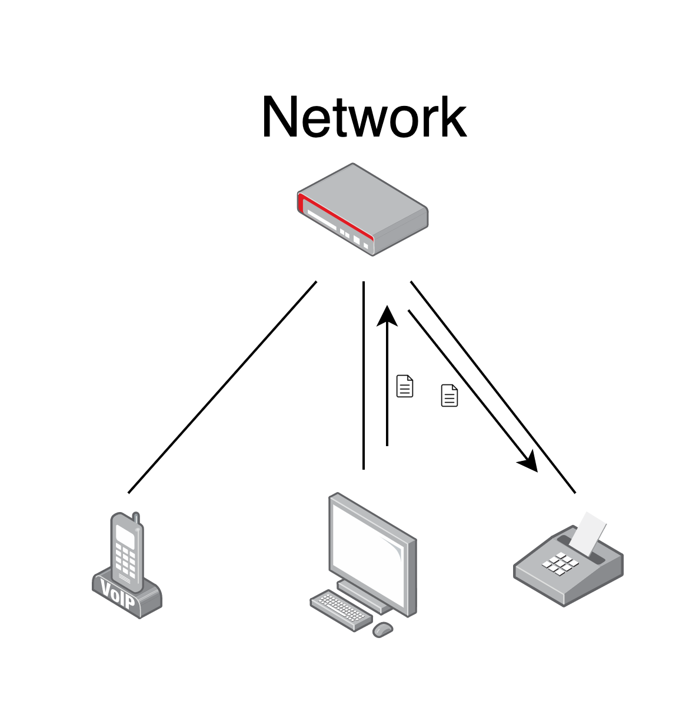
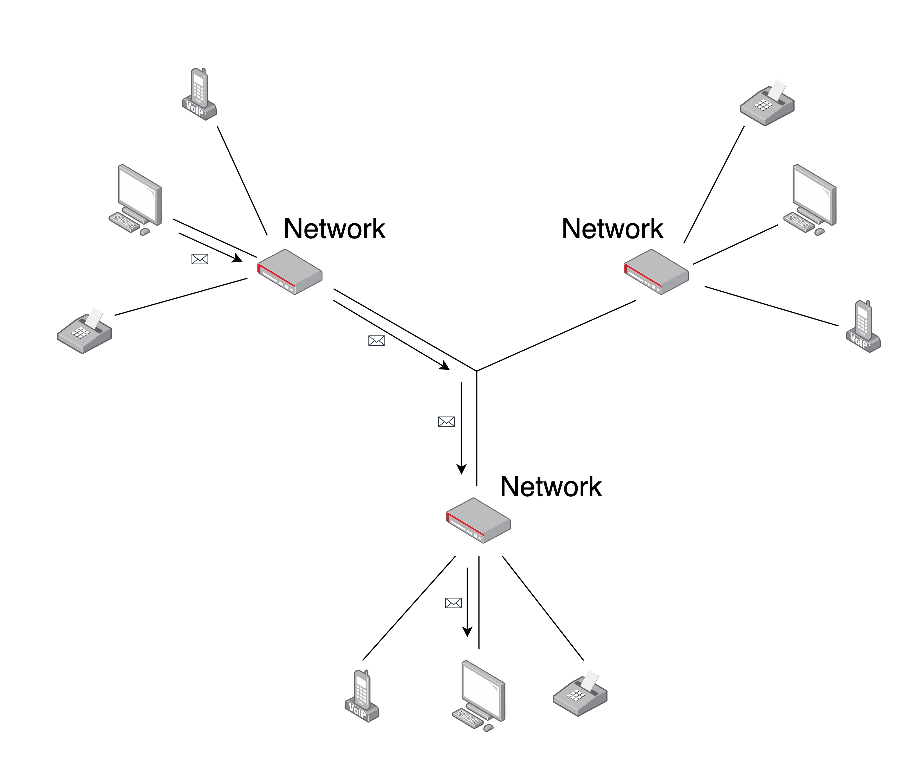

# What is the internet?

**Learning Objectives**
- Know what the internet is
- Know what an IP address is
- Know what HTTP is
- Understand the request/response cycle
- Know what DNS is
- Understand the role of a client and a server

## What is the internet?
**Learning Objectives**
- Know what the internet is

The internet is a network of networks of devices.
A standard network of devices is something like you'd find in an office or a home, it's a piece of technology that allows different devices to communicate with eachother; for instance at home you might have your computer and printer connected to your network, allowing your computer to send your printer documents to be printed.

The internet is a larger version of that, where instead of allowing communication between *devices*, it allows communication between *networks*; thus in turn allowing communication between devices connected to *different* networks.

The way this works is far more complex than what's illustrated, and has far more moving parts; some of which we're about to reasearch and talk about.

## Parts of the internet
**Learning Objectives**
- Know what an IP address is
- Know what HTTP is
- Understand the request/response cycle
- Know what DNS is
- Understand the role of a client and a server

### Reference Guide
**IP Address:** An IP address (Internet Protocol Address) is a number assigned to each device connected to a network; used to identify a host's network interface, and then the location of the specific device on the network. Therefore it basically communicates *where* anything is on the internet: firstly pointing to the network, then to the device on that network.

**HTTP:** HTTP (Hypertext Transfer Protocol) is a system of rules which enables the retrieval of resources such as HTML documents, images, videos, other files & media, JSON & XML data, and many other things over the internet. It acts as a layer between the very complicated protocols used to transfer data over the internet and the users of the internet, providing a client-server architecture which is much easier to conceptualise and implement.

**Clients & Servers:** Clients and servers are two parts of the HTTP architecture and are used to allow the transference of data over the internet in a 'request/response cycle'. Typically a server is a piece of software which will store and provide data or documents to a requesting client. The most common example of this is when a user of a web browser (the client) types a URL like `http://google.com` into their address bar: this will request the Google homepage from a _web server_ (the server) owned by Google, which will then respond with the code to render the webpage on the screen.

**Request/Response Cycle:** The request/response cycle is the main mechanism of communication in the HTTP client/server architecture. The cycle goes as follows: the client (most commonly a web browser) will send a message to a server somewhere on the internet asking for something to happen, and will begin to wait for a reply; this is called a _request_. The server will then send a message back to the waiting client, either with the requested data, with a confirmation that the requested action was successful, or a message explaining why it was unsuccessful; this is called a _response_. Upon reception of the response, the client will close the awaiting request, and that iteration of the request/response cycle is complete.

**DNS:** DNS (Domain Name System) is a decentralised naming system primarily used to relate _domain names_ (eg. `google.com`) to their associated IP addresses (their location on the internet, eg. `168.3.89.10`). The main function of this is to allow users of the internet to work with human-readable references to websites, like domains, while allowing devices on the internet to use the associated IP addresses to find the resources associated with those domains. In practice, when someone types `google.com` into their internet browser, it will perform a _DNS Lookup_ to find the IP address for that domain, which will direct the request for the Google homepage to their web servers.

### Mini quiz 

Can you answer these questions? 

- What is an IP address?
- What is HTTP?
- What are the differences between a client and server in web development?
- What is the request/response cycle in web development?
- What is DNS?