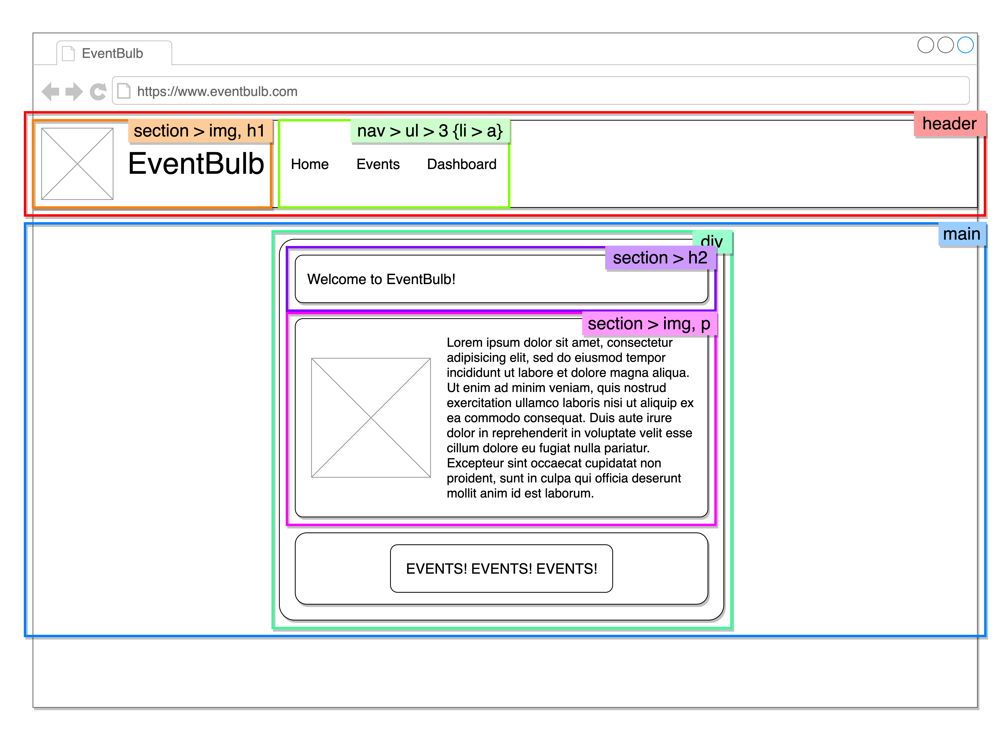

# Wireframes
**Learning Objectives**
- Understand the purpose of wireframes
- Be able to translate a wireframe into HTML elements and CSS layouts

## What are wireframes?
**Learning Objectives**
- Understand the purpose of wireframes

Wireframes are rough illustrations of designs for software products:
- Not detailed
- Generated from storyboarding and user stories/journeys
- Placeholder text
- Not usually coloured
- Usually communicate layouts more than aesthetics:
  - Flexboxes/Grids
  - Box model (margin & padding)
  - Element sizes
- Usually enough to break down into HTML & CSS layouts

Wireframes can serve many purposes in the development process:
- Paper prototype testing
- Allow developers to start building early
- Quick feedback from stakeholders
- Brainstorming

Wireframes are more detailed than sketches but a far cry from a high fidelity mock-up.
- Balances between detail and time/cost
- Don't necessarily require speciality skills or specific tools
  - Most people can wireframe, however _design_ is a totally different skill

## Breaking down a wireframe
**Learning Objectives**
- Be able to translate a wireframe into HTML elements and CSS layouts

Let's break down a wireframe into semantic HTML, then CSS layouts.

### The Wireframe
> Show and talk through wireframe with students

### Semantic HTML
> Annotate wireframe breaking down into semantic pieces of content
> - Can do this on board, Zoom, or show these diagrams
> - Explain each decision as it's broken down and annotated

> Note with the students that there's no semantic tag to use for the `div` box
> - Explain that a `
` can be used to aid styling and layout without describing content
> - Describe the use of `
` here, allowing us to style that box without misusing a semantic tag

> Note with the students that despite its button-like styling, `<a>` is semantic as this 'button' will only act as a link to another page

### The CSS
> Annotate wireframe breaking down into css layouts
> - Can do this on board, Zoom, or show these diagrams
> - Explain each decision as it's broken down and annotated
> - Point out that `align-items`, `justify-content`, most margins & padding, and some other layout properties are not being annotated
> - Elements not using layouts or relevant properties are ignored in the annotation

### Annotated Resources
#### HTML Breakdown

#### CSS Layout Breakdown

